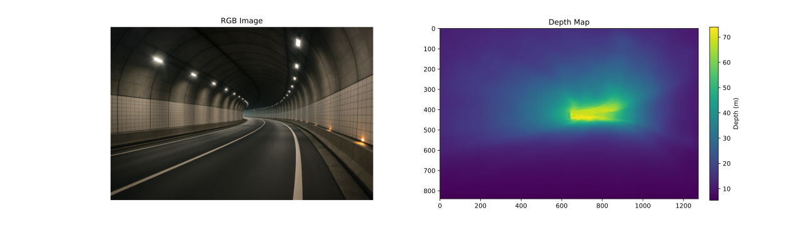

# Combined Fusion
Combined Fusion is a general zero-shot lightweight model that can be used in indoor/outdoor scenes to predict Monocular Metric depth map. 



## Inference deploy
```python

cfModel = CombinedFusion()
cfModel.load_state_dict(torch.load('./CombinedFusion.pth', map_location='cpu'))
cfModel = cfModel.to(DEVICE).eval()
```
and also example.py already have a full example of using model. just execute: `python example.py`.

## FPS performance
a comparison FPS on random video on internet, you can look at the FPS counter and also so many details for instance: the hair of man before pushing the ball.


https://github.com/user-attachments/assets/7373d925-543d-49a1-bd83-a7e93439c31e


## Training

Use DepthAnythingV2 metric fine tune codes, and just replace the model with our model  [`CombinedFusion` folder](./CombinedFusion/). 


## Citation
This work is related to a paper currently under review.
We will update this section with the official citation once the paper is accepted.
